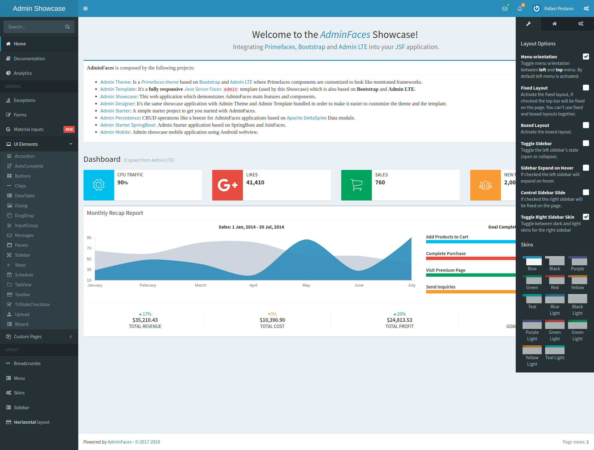

= Admin Showcase

image:https://travis-ci.org/adminfaces/admin-showcase.svg[Build Status (Travis CI), link=https://travis-ci.org/adminfaces/admin-showcase]
image:https://badges.gitter.im/Join%20Chat.svg[link="https://gitter.im/adminfaces?utm_source=badge&utm_medium=badge&utm_campaign=pr-badge&utm_content=badge"]

*AdminFaces* showcase application.

== Demo 

Showcase is available on http://admin-showcase-admin-showcase.7e14.starter-us-west-2.openshiftapps.com/showcase/index.xhtml[Openshift here^].

IMPORTANT: The demo runs on the Openshift starter which is a platform used just for testing and not for production. So it's likely the showcase may be slow or *even down*.

== Running locally

There are several ways to run Admin Showcase on your machine. Just clone this repository and use one of the alternatives described below.

=== Using an application server

Admin Showcase is compatible with most JavaEE 6 and 7 application servers.

Just build the application with maven using `mvn clean package -DskipTests` and deploy the resulting `showcase.war` into a JavaEE 6 or greater server.

NOTE: No configuration is needed.

Following is the list of tested servers:

.Supported Application Servers

This application is compatible with `Java EE 6/7` application servers, tested with:

* http://wildfly.org/downloads/[WildFly *10.1.0* and *8.2.0*^]
* https://developers.redhat.com/download-manager/file/jboss-eap-6.4.0.GA.zip[JBoss EAP *6.4*^]
* http://tomee.apache.org/downloads.html[Tomee *7.0.2* Web profile and *1.7.4* Web]
* http://www.payara.fish/all_downloads[Payara *4.1.1.164* Web profile]
* https://developer.ibm.com/wasdev/downloads/liberty-profile-using-non-eclipse-environments/[WebSphere Liberty profile *16.0.0.4*^]

=== WildFly Swarm

This showcase is http://wildfly-swarm.io/[Wildfly Swarm^] compatible, just run the following command:

----
mvn wildfly-swarm:run  -Pswarm
----

and access `http://localhost:8080/showcase`.

=== Docker

You can run this showcase via docker through the following command:

----
docker run -it -p 8080:8080 rmpestano/admin-showcase
----

== Testing

To execute functional tests you need to activate the `tests` profile and choose the application server also using a maven profile, ex:

----
mvn clean package -P tests -P wildfly8-managed
----

NOTE: wildfly8-managed is activated by default.

By default tests run on chrome, to change the webdriver you need to use the property `browser`:

----
mvn test -Ptomee-remote -Dbrowser=phantomjs
----

== Documentation

Documentation can be found here: http://admin-showcase-admin-showcase.7e14.starter-us-west-2.openshiftapps.com/showcase/docs/
